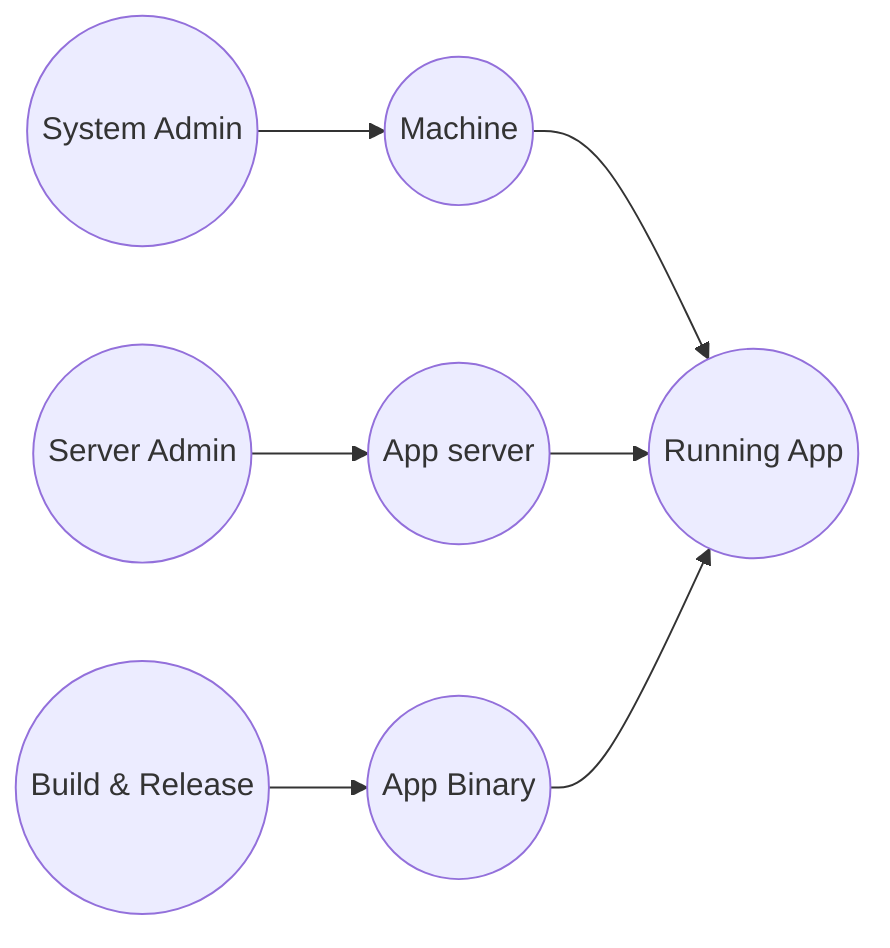
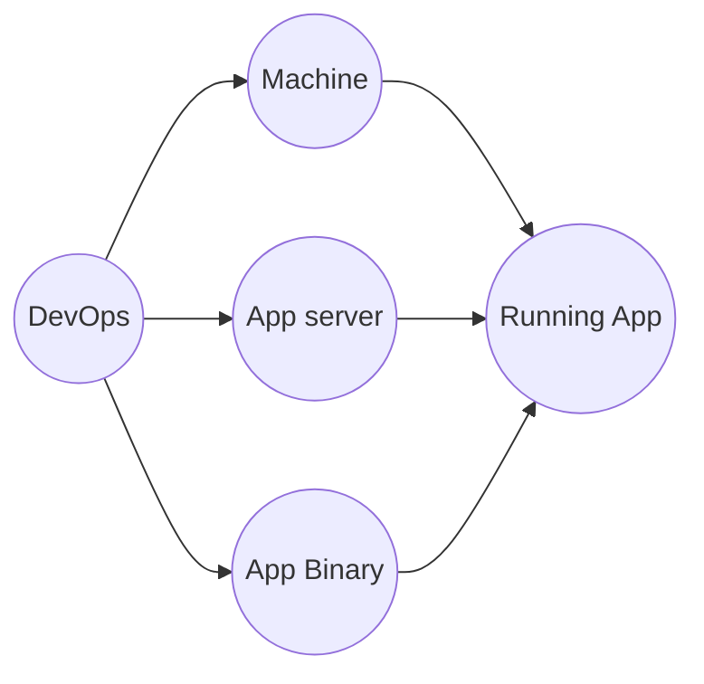

# What is DevOps

DevOps is the combination of cultural philosophies, practices, and tools that increases an organisation's  ability to deliver applications and services at high velocity: evolving and improving products at a faster pace than organisations using traditional software development and infrastructure management processes. This speed enables organisation's to better serve their customers and compete more effectively in the market.

In simple terms, DevOps is about removing the barriers between traditionally siloed teams, development and operations. Under a DevOps model, development and operations teams work together across the entire software application life cycle, from development and test through deployment to operations.

**Old siloed methodology :**

**DevOps methodology :**

# Pillars of DevOps

1. Collaboration
2.  CI/CD
3. Automation
4. Testing
5. Monitoring/Observability
6. Communication

